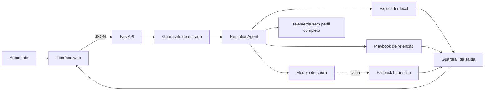

# RetentionAI

Agente auditável para previsão de churn e apoio à retenção de clientes.

> Trilha 1 · Projeto 1 — Previsão de churn  
> Integrante: Carlos Henrique de Souza Bispo  
> Matrícula: 211061529  
> Aplicação: `http://localhost:8000` (link público será incluído após o deploy)  
> API interativa: `http://localhost:8000/docs`  
> Vídeo: [demonstração no YouTube](https://youtu.be/lLQH8TB4JKk)  
> Repositório: <https://github.com/unb-Sistemas-de-Machine-learning/projeto-final-2026-1>

O RetentionAI recebe o perfil contratual de um cliente, estima sua probabilidade de
cancelamento, explica quais sinais mais influenciaram o resultado e sugere até três ações
de retenção. A estimativa apoia uma conversa humana; ela não toma decisões automaticamente.

## Início rápido

Com Docker (recomendado):

```bash
docker compose up --build
```

Acesse <http://localhost:8000>. O artefato treinado já acompanha o projeto, portanto a
aplicação não precisa baixar o dataset nem chamar serviços externos para iniciar.

Sem Docker:

```bash
python -m venv .venv
# Linux/macOS: source .venv/bin/activate
# Windows PowerShell: .\.venv\Scripts\Activate.ps1
python -m pip install -r requirements-dev.txt
python -m app.training
uvicorn app.main:app --reload
```

Para validar:

```bash
pytest --cov=app
ruff check .
```

## Definição do problema

Cancelar um serviço é normalmente o fim de uma sequência de atritos. Quando a empresa só
reage ao pedido de cancelamento, a janela de recuperação já é curta. O RetentionAI prioriza
perfis que merecem uma abordagem preventiva e oferece ao atendente uma explicação e um
próximo passo.

Stakeholders:

- equipe de retenção, que precisa priorizar contatos;
- atendimento, que precisa entender o contexto antes de abordar o cliente;
- gestão, que acompanha efetividade e custo das campanhas;
- clientes, que podem receber uma solução antecipada, mas também podem ser prejudicados
  por abordagens invasivas ou por uma previsão incorreta.

Métrica de negócio proposta: recuperar pelo menos 15% dos clientes de alto risco contatados
em um piloto, sem ultrapassar duas reclamações por mil contatos. Essa métrica exige dados
reais de campanha e ainda não foi medida neste protótipo.

Métrica técnica principal: **recall da classe churn**, pois deixar de identificar quem vai
cancelar perde a oportunidade de retenção. Precision e PR-AUC continuam visíveis para
controlar o custo de contatos desnecessários.

## Arquitetura



O agente implementa um fluxo controlado, adequado ao risco do caso:

1. valida a estrutura e a coerência entre serviços;
2. chama a ferramenta de predição;
3. extrai contribuições locais dos coeficientes do modelo;
4. consulta um playbook determinístico de ações;
5. valida probabilidade, justificativas e recomendações;
6. registra latência, faixa de risco e uso de fallback.

Não foi usado um LLM na versão final. Uma explicação generativa acrescentaria custo,
latência e risco de alucinação sem melhorar o núcleo desta tarefa tabular. A camada agente
ainda vai além de uma previsão isolada: decide quais ferramentas chamar, explica o
resultado, aplica regras de segurança e propõe ações.

## Modelo, dados e contexto

O modelo é uma regressão logística com:

- imputação mediana para variáveis numéricas;
- padronização das três variáveis numéricas;
- imputação pela moda e one-hot encoding para variáveis categóricas;
- separação estratificada 80/20, com `random_state=42`;
- limiar escolhido pelo maior F2 no conjunto de teste.

A regressão logística foi preferida por ser rápida, pequena e diretamente explicável.
Random Forest e gradient boosting foram considerados, mas não adotados no MVP porque a
melhora potencial precisaria justificar uma explicação mais complexa. Uma comparação
controlada entre modelos é um próximo passo.

O contexto é o **IBM Telco Customer Churn**, com 7.043 perfis e 21 colunas. A origem, o
preparo e as restrições estão no [Data Card](docs/DATA_CARD.md). A cópia utilizada integra
o repositório oficial da IBM distribuído sob
[Apache License 2.0](https://github.com/IBM/telco-customer-churn-on-icp4d/blob/master/LICENSE).
O CSV não é versionado neste projeto; o treino o baixa diretamente da fonte atribuída.

Para reproduzir o treino:

```bash
python -m app.training
```

O comando baixa a cópia hospedada no repositório da IBM, valida o schema, treina o pipeline
e atualiza `artifacts/churn_model.joblib` e `artifacts/metrics.json`.

## Avaliação

Resultados no conjunto de teste estratificado de 1.409 clientes:

| Métrica | Resultado |
|---|---:|
| ROC-AUC | 0,8419 |
| PR-AUC | 0,6338 |
| Recall | 0,9225 |
| Precision | 0,4378 |
| F1 | 0,5938 |
| F2 | 0,7553 |
| Limiar de decisão | 0,1412 |

Matriz de confusão: 345 verdadeiros positivos, 29 falsos negativos, 443 falsos positivos e
592 verdadeiros negativos. O limiar baixo é intencional: favorece cobertura para uma
triagem de retenção, mas 43,78% de precision significa que o sistema não deve disparar
benefícios caros automaticamente.

Nos recortes de teste, o recall foi 0,9171 para mulheres e 0,9282 para homens. Para pessoas
não idosas foi 0,9022 e para pessoas idosas 0,9796; porém a taxa de falsos positivos foi
0,3952 e 0,6694, respectivamente. Isso exige monitoramento: clientes idosos podem ser
abordados em excesso. Esses recortes são diagnóstico, não prova de equidade.

As métricas completas e reproduzíveis estão no
[Model Card](docs/MODEL_CARD.md) e em [`artifacts/metrics.json`](artifacts/metrics.json).

## Guardrails e confiabilidade

Entrada:

- schema fechado: campos desconhecidos são rejeitados;
- limites de domínio para tempo e cobranças;
- consistência entre telefone e múltiplas linhas;
- consistência entre acesso à internet e serviços adicionais;
- payload limitado a 50 KB;
- divergência grande entre mensalidade, tempo e total gera aviso, não rejeição.

Saída:

- probabilidade sempre entre 0 e 1;
- resposta sempre contém fator explicativo e ação;
- caso próximo ao limiar recebe aviso para revisão humana;
- mensagens técnicas nunca são devolvidas ao usuário.

Fallback:

- se o artefato estiver ausente, corrompido ou falhar na inferência, uma heurística
  conservadora e explícita assume a triagem;
- a resposta vem marcada com `model_source: "fallback"` e recomenda revisão manual;
- `/health` muda para `degraded`, sem derrubar a interface.

Monitoramento:

- `/health`: disponibilidade do modelo;
- `/api/v1/metrics`: volume, latência média, faixas de risco e taxa de fallback;
- `/api/v1/model-card`: métricas congeladas do treino;
- `logs/predictions.jsonl`: somente identificador técnico da requisição, faixa, fonte,
  latência e número de avisos. O perfil e o `customer_id` não são persistidos.

## API

Endpoint principal: `POST /api/v1/predict`.

```bash
curl -X POST http://localhost:8000/api/v1/predict \
  -H "Content-Type: application/json" \
  -d '{
    "gender": "Female",
    "senior_citizen": 0,
    "partner": "No",
    "dependents": "No",
    "tenure": 3,
    "phone_service": "Yes",
    "multiple_lines": "No",
    "internet_service": "Fiber optic",
    "online_security": "No",
    "online_backup": "No",
    "device_protection": "No",
    "tech_support": "No",
    "streaming_tv": "Yes",
    "streaming_movies": "Yes",
    "contract": "Month-to-month",
    "paperless_billing": "Yes",
    "payment_method": "Electronic check",
    "monthly_charges": 95.5,
    "total_charges": 286.5
  }'
```

O contrato completo e exemplos ficam disponíveis em `/docs` (OpenAPI/Swagger).

## UX e demonstração

A interface traduz os valores técnicos do dataset para português, oferece perfis de
demonstração de alto e baixo risco e apresenta:

- probabilidade e faixa visual de risco;
- quatro sinais de maior contribuição;
- até três ações priorizadas;
- avisos de qualidade dos dados e incerteza;
- estado de carregamento e erros compreensíveis.

Roteiro sugerido para o vídeo:

1. abrir a aplicação e selecionar “alto risco”;
2. enviar e mostrar probabilidade, fatores e playbook;
3. trocar para “baixo risco” e comparar o resultado;
4. alterar uma cobrança para demonstrar o aviso de coerência;
5. abrir `/docs`, `/health` e `/api/v1/metrics`;
6. explicar em menos de um minuto o fallback e a revisão humana.

Vídeo da demonstração: [assistir no YouTube](https://youtu.be/lLQH8TB4JKk).

> Antes da entrega, substitua `SEU_VIDEO_ID` pelo identificador real do vídeo nas duas
> ocorrências deste README.

## Iterações e decisões

- **Baseline:** pipeline tabular retornando apenas a probabilidade. Era tecnicamente útil,
  mas insuficiente para orientar uma ação.
- **Agente:** explicação local e playbook foram separados em ferramentas, mantendo cada
  decisão rastreável.
- **Confiabilidade:** foram adicionados guardrails de coerência, fallback marcado,
  mensagens amigáveis e telemetria sem o perfil.
- **UX:** o formulário passou a sincronizar automaticamente combinações impossíveis, como
  adicionais de internet quando não há internet.

Limitações atuais:

- a amostra da IBM é antiga e pode ser sintética; não representa necessariamente uma
  operadora brasileira;
- probabilidade não foi recalibrada em dados de produção;
- o limiar foi escolhido no mesmo holdout usado para relatar desempenho;
- recomendações são um playbook acadêmico e ainda não passaram por experimento causal;
- faltam autenticação, limite por usuário e armazenamento centralizado de observabilidade
  para um ambiente corporativo.

## Impactos e ética

Um falso negativo deixa passar uma oportunidade de retenção. Um falso positivo pode gerar
contato indesejado, desconto desnecessário ou tratamento desigual. Por isso o produto:

- não recomenda negar serviço, alterar preço ou limitar direitos;
- apresenta a previsão como apoio, não certeza;
- exige decisão humana e mostra casos próximos ao limiar;
- não usa o gênero diretamente nas recomendações;
- mede desempenho por grupos e expõe a diferença observada;
- evita persistir atributos pessoais nos logs.

Em produção, gênero e idade devem ser avaliados como possíveis atributos sensíveis,
inclusive em um modelo alternativo sem essas features. O cliente também deve poder recusar
contatos de marketing.

## Estrutura

```text
.
├── app/
│   ├── static/             # interface web
│   ├── agent.py            # orquestração e playbook
│   ├── main.py             # API FastAPI
│   ├── model_service.py    # inferência, explicação e fallback
│   ├── monitoring.py       # telemetria
│   ├── schemas.py          # contrato e guardrails
│   └── training.py         # treino reproduzível
├── artifacts/              # modelo e métricas versionados
├── data/raw/               # CSV ignorado pelo Git
├── docs/                   # Data Card e Model Card
├── tests/                  # testes unitários e de integração
├── compose.yaml
├── Dockerfile
└── requirements*.txt
```

## Deployment

O container roda como usuário sem privilégios, possui healthcheck e não depende de um LLM
externo. Para publicar, Render, Railway ou Google Cloud Run podem construir diretamente o
`Dockerfile`. Configure um volume para `/app/logs` caso precise preservar a telemetria.

Passos ainda dependentes da conta do autor:

1. criar o serviço na plataforma escolhida;
2. publicar a imagem;
3. testar `/health` e um caso de ponta a ponta;
4. substituir o link local no cabeçalho pelo endereço público.

## Referências

- IBM, [Customer Churn Prediction](https://github.com/IBM/customer-churn-prediction).
- IBM, [Telco Customer Churn on Cloud Pak for Data](https://github.com/IBM/telco-customer-churn-on-icp4d).
- scikit-learn, [Logistic Regression](https://scikit-learn.org/stable/modules/linear_model.html#logistic-regression).
- scikit-learn, [Precision-Recall](https://scikit-learn.org/stable/auto_examples/model_selection/plot_precision_recall.html).
- FastAPI, [documentação](https://fastapi.tiangolo.com/).

Código deste projeto: [licença MIT](LICENSE). A cópia do dataset usada no treino pertence
ao repositório da IBM sob Apache License 2.0.
